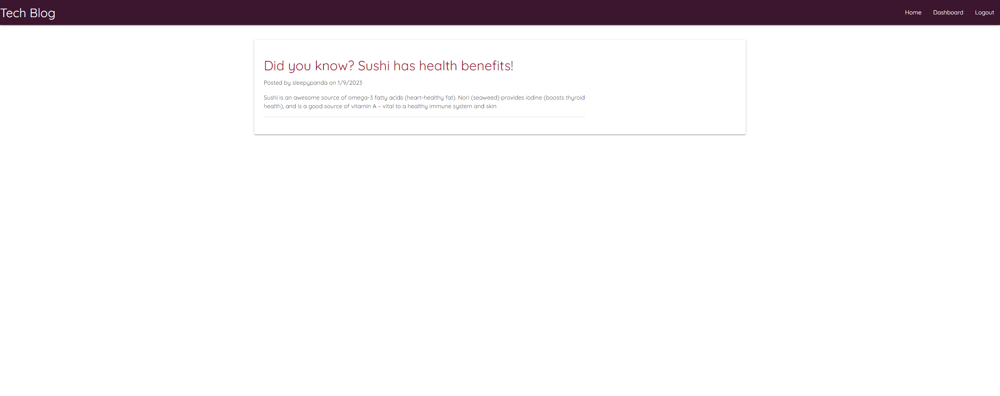

# Tech Blog

## Description

The motivation and purpose behind this project was to create a site where a user can either register or login with pre-existing credentials. The site will then allow users to create posts as well as comment on them onces they're logged in. I learned a lot about handlebars and properly linking the files to the front end to create a fullstack application.

## Table of Contents 

- [Installation](#installation)
- [Usage](#usage)
- [Credits](#credits)
- [License](#license)

## Installation

Everything in credits is needed to run the app. After installing them all you are going to login to sequelize and source the schema. Then, you will run the seed with ```npm run seed``` and lastly you'll start the server!

## Usage

Link to heroku app: [here](https://dashboard.heroku.com/apps/protected-stream-49179)





## Credits

[Nodemon](https://www.npmjs.com/package/nodemon)

[Sequelize](https://www.npmjs.com/package/sequelize)

[MySQL 2](https://www.npmjs.com/package/mysql2)

[Express-handlebars](https://www.npmjs.com/package/express-handlebars)

[Dotenv](https://www.npmjs.com/package/dotenv)

[Bcrypt](https://www.npmjs.com/package/bcrypt)

[Express-session](https://www.npmjs.com/package/express-session)

[Connect-session-sequelize](https://www.npmjs.com/package/connect-session-sequelize)

## License

MIT License

A short and simple permissive license with conditions only requiring preservation of copyright and license notices. Licensed works, modifications, and larger works may be distributed under different terms and without source code.